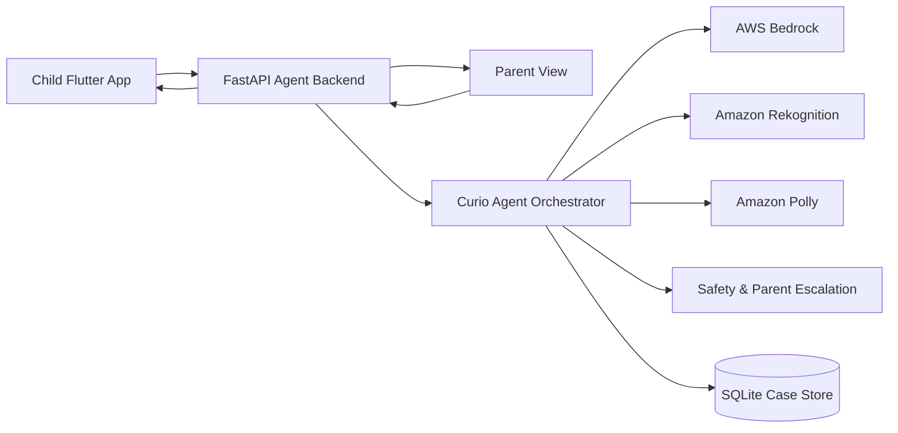

# Curiosity Quest

Curiosity Quest is a safety-first investigation agent for kids and parents. A child can ask a question with a photo, voice, or text, and Curio turns it into a playful case board: clues, the child's theory, Curio's finding, a next mission, and a badge. The goal is not to simply label an image, but to help children learn how to observe, wonder, test ideas, and ask a better next question.

The app is built for the Agents for Humans Hackathon. It uses AWS Bedrock for live reasoning, Amazon Rekognition for visual evidence, Amazon Polly for voice experiments, and a Python agent backend that keeps the child experience dynamic instead of relying on static canned answers.

## Who It Is For

- Children ages 3-6 who need a simpler, more visual, voice-friendly discovery flow
- Children ages 7-9 who can handle richer investigation cards, puzzles, and evidence reasoning
- Parents who want curiosity tools with guardrails, safety escalation, and visibility into risky moments
- Schools, museums, nature centers, and family-learning contexts where children ask open-ended real-world questions

## Why It Matters

Children ask questions constantly, but adults are not always available to turn every question into a safe learning moment. Generic AI can also answer too confidently, miss physical-world risk, or give a child instructions that should involve an adult.

Curiosity Quest is designed around a safer loop:

1. Observe the clue.
2. Make a careful hypothesis.
3. Explain uncertainty in child-friendly language.
4. Ask for one safe next clue.
5. Escalate risky situations to a grown-up.
6. Save the case as part of the child's discovery journey.

## What Works Now

- Flutter app with 3-6 and 7-9 child experiences plus parent areas
- Photo, text, and voice-entry oriented investigation flows
- Dynamic AI responses from Bedrock for open-ended child questions
- Rekognition-backed visual evidence for uploaded images
- Case Board answer format with clues, theory, finding, next mission, and badge moments
- Dynamic puzzle generation for both age bands
- Parent PIN area and safety settings
- Safety detection for emergencies, risky objects, adult-gated tasks, and parent notification routing
- Badge and discovery counters connected to app state
- Backend readiness and probe endpoints for demo checks
- SQLite-backed local persistence for investigation payloads
- Deterministic fallback mode for local demos when live AI is unavailable

## Architecture

The full architecture diagram is in [docs/ARCHITECTURE.md](docs/ARCHITECTURE.md). A standalone Mermaid source is also available in [docs/architecture.mmd](docs/architecture.mmd).



## Run The Backend

```bash
cd backend
lsof -ti :8000 | xargs kill -9 2>/dev/null || true
. .venv311/bin/activate
CURIO_DEMO_MODE=false uvicorn app.main:app --host 127.0.0.1 --port 8000
```

Quick health checks:

```bash
curl http://127.0.0.1:8000/agent/aws-readiness
curl http://127.0.0.1:8000/agent/ai-probe
curl "http://127.0.0.1:8000/puzzles?age_band=3-6"
curl "http://127.0.0.1:8000/puzzles?age_band=7-9"
```

If Bedrock uses a bearer token on your machine, export the current key before starting the backend:

```bash
export AWS_BEARER_TOKEN_BEDROCK="your-bedrock-api-key"
```

## Run The Frontend

```bash
cd frontend
flutter pub get
flutter run -d chrome --dart-define=CURIO_API_BASE_URL=http://127.0.0.1:8000
```

For Android emulator testing, use:

```bash
flutter run -d emulator --dart-define=CURIO_API_BASE_URL=http://10.0.2.2:8000
```

## Repository Structure

```text
backend/    FastAPI agent service, AWS integrations, safety logic, persistence
frontend/   Flutter child and parent app
docs/       Submission checklist, architecture, demo script, AWS Builder post draft
LICENSE     MIT license
```

## Submission Assets

- [docs/SUBMISSION_CHECKLIST.md](docs/SUBMISSION_CHECKLIST.md): what is still needed before Devpost submission
- [docs/DEVPOST_FIELDS.md](docs/DEVPOST_FIELDS.md): field-by-field Devpost copy and upload guide
- [docs/devpost/00_COPY_PASTE_INDEX.md](docs/devpost/00_COPY_PASTE_INDEX.md): separated Devpost field files for copy-paste
- [docs/SUBMISSION_DESCRIPTION.md](docs/SUBMISSION_DESCRIPTION.md): ready-to-paste Devpost description
- [docs/DEMO_VIDEO_SCRIPT.md](docs/DEMO_VIDEO_SCRIPT.md): 3-5 minute demo video structure
- [docs/ARCHITECTURE.md](docs/ARCHITECTURE.md): architecture diagram and system explanation
- [docs/AWS_BUILDER_POST_DRAFT.md](docs/AWS_BUILDER_POST_DRAFT.md): bonus AWS Builder post draft

## Demo Video Pitch

The video should show:

1. The problem: kids ask real-world questions, but answers need safety, uncertainty, and follow-up.
2. Who it is for: 3-6 and 7-9 children, plus parents.
3. A working photo investigation: upload a real-world image and show Curio's dynamic case board.
4. A text question: ask an open-ended question and show a non-static AI answer.
5. A safety moment: show how risky content gives child-safe guidance and parent escalation.
6. A puzzle or badge moment: show the game loop that makes curiosity feel rewarding.
7. The architecture: Flutter, FastAPI, Bedrock, Rekognition, Polly, safety, and persistence.

## License

This project is released under the MIT License. See [LICENSE](LICENSE).
