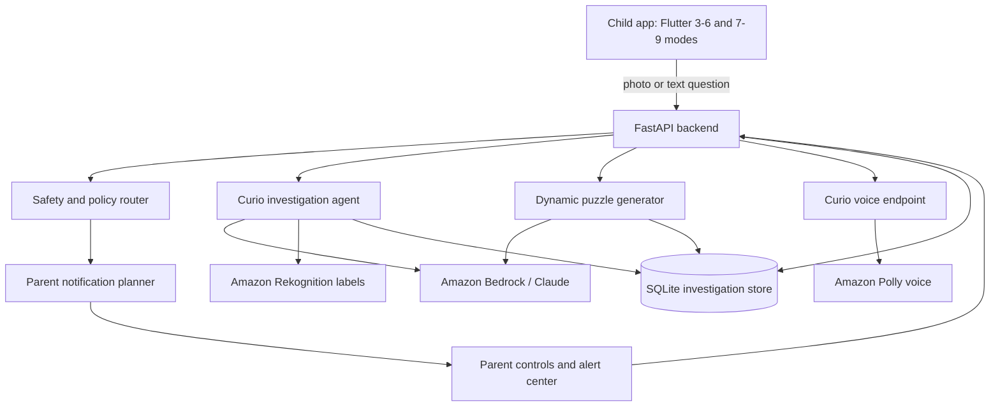

# Curiosity Quest Architecture

Curiosity Quest is a child-facing investigation agent with a parent safety layer. The app turns a photo or text question into a visible evidence loop: observe, hypothesize, ask for the missing clue, answer safely, and notify a parent when risk appears.

## System Diagram

## Main Components

- `frontend/`: Flutter app with two age modes. The 3-6 experience uses simpler cards, bigger controls, and guided answers. The 7-9 experience exposes fuller case-board reasoning.
- `backend/app/main.py`: FastAPI entry point for investigations, image uploads, puzzles, parent registration, runtime probes, and TTS.
- `backend/app/service.py`: Main investigation orchestration and text/image answer flow.
- `backend/app/agent_core.py`: Live Bedrock/Strands-style structured investigation plan generation.
- `backend/app/policy.py`: Child safety routing and parent alert decisions.
- `backend/app/puzzles.py`: Dynamic puzzle cards backed by live AI in non-demo mode.
- `backend/app/tts.py`: Amazon Polly text-to-speech integration for Curio voice.
- `backend/app/store.py`: Local SQLite persistence for investigation payloads.

## Data Flow

1. A child asks a question or uploads a photo.
2. The backend checks safety and routes the request by domain.
3. Curio generates an age-appropriate answer, hypothesis, next mission, badge, and uncertainty note.
4. Risky content triggers child-safe instructions and a parent alert plan immediately.
5. The frontend shows a case board: photo, clues, child theory, Curio finding, next mission, and badge.
6. The child can answer Curio's follow-up, which starts another live AI turn.
7. Puzzle cards are generated from the same learning context rather than being hardcoded.

## AWS Services Used

- Amazon Bedrock for live Curio answers and puzzle generation.
- Amazon Rekognition for image label evidence.
- Amazon Polly for child-friendly voice output.
- AWS credentials are read from environment variables; `.env` files are intentionally ignored by git.

## Safety Design

The child side receives step-by-step guidance, especially for danger signals such as knives, fire, injury, unsafe foods, or public-location privacy. Parent notification planning happens immediately in the backend so the parent view can surface urgent review items without waiting for the child to continue.
